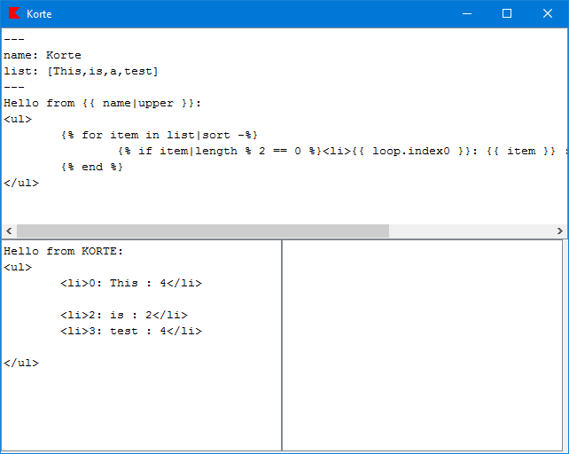

# Kotlin cORoutines Template Engine

Port of my template engine based on twig/django [atpl.js](https://github.com/soywiz/atpl.js) + goodies.

Allow **suspension points** on read properties and method calling. Uses korio and virtual filesystems.

It intends to be a non strict superset with common parts (when finished) of of [twig](http://twig.sensiolabs.org/)/[jinja](http://jinja.pocoo.org/)/[django](https://www.djangoproject.com/)
+ [liquid](https://github.com/Shopify/liquid/wiki) except some project specific stuff.
So a kotlin [jekyll](https://jekyllrb.com/) port can happen.
Also you will be able migrate websites using twig to kotlin easier.
That jekyll-like will be able to compile into a single nodejs javascript/or native executable using [jtransc](https://github.com/jtransc/jtransc) and/or kotlin.js
so no more ruby installing issues or file watching issues on windows.

## Live demo

Online interactive real-time live demo using [Korte](https://github.com/soywiz/korte) + [Korui](https://github.com/soywiz/korui) compiled to JavaScript using [JTransc](https://github.com/jtransc/jtransc):

[https://soywiz.github.io/kor_samples/korte1/](https://soywiz.github.io/kor_samples/korte1/)

[](https://soywiz.github.io/kor_samples/korte1/)

## Supported stuff

### Jekyll FrontMatter + layout + {{ content }}

```django
mylayout:
<side>My side</side><article>{{ content }}</article>

template:
---
layout: mylayout
---
Content
```

### Twig inheritance

```django
mylayout:
<body>
<side>My side</side><article>{{ content }}</article>
</body>

template:
---
layout: mylayout
---
Content
```

### Tags syntax

It supports normal twig/liquid blocks.
Though it supports both `` and just `` for convenience.
In examples I will just use `` on required blocks for the sake of brevity.

Examples of already supported syntax:

```django

{# inheritance + cross templates #}
 {# plain twig extends #}
 {# conditional extends with arbitrary expressions #}
... {# twig blocks inheritance #}
 {# template to include #}

{# for #}
{{ v }} {# plain for + array notation #}
{{ k }}{{ v }} {# for with maps and keys + object notation #}
{{ v }}empty {# for+else for empty collections #}
{{ n }}:{{ loop.index0 }}:{{ loop.index }}:{{ loop.revindex }}:{{ loop.revindex0 }}:{{ loop.first }}:{{ loop.last }}:{{ loop.length }}{{ '\\n' }} {# for with loop object information about the iteration step #}

{# if #}
just for mobile
mobiledesktop
zeroless than fiveother
collection contains one

{# debug #}
 {# will display by the standard output the string hello (used for debuging) #}

{# set #}
{# set name = "Test" #} 

```

### Allows extending Tags + Blocks + Filters

```kotlin
class TemplateConfig(
	extraTags: List<Tag> = listOf(),
	extraFilters: List<Filter> = listOf()
)
```

